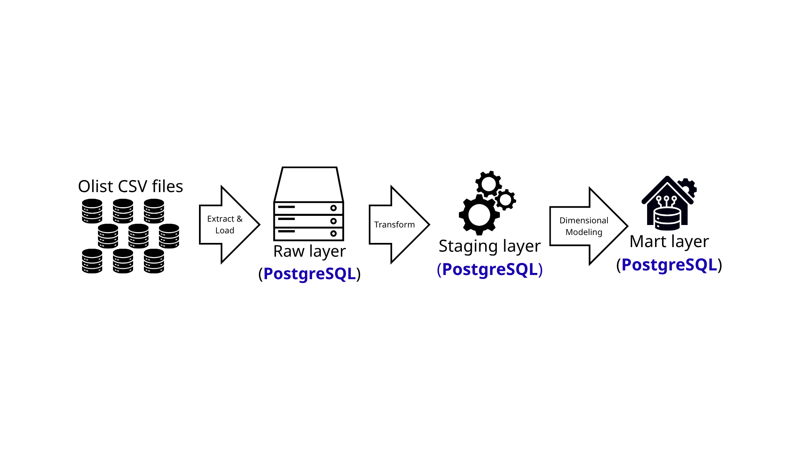
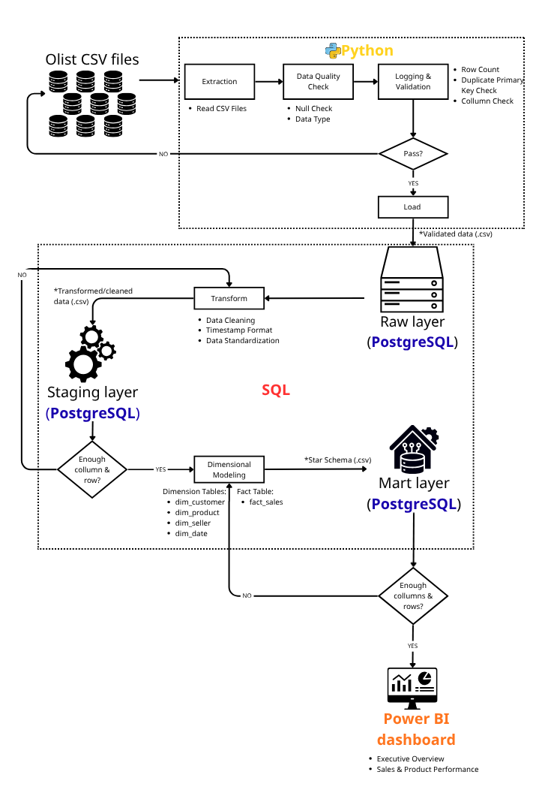
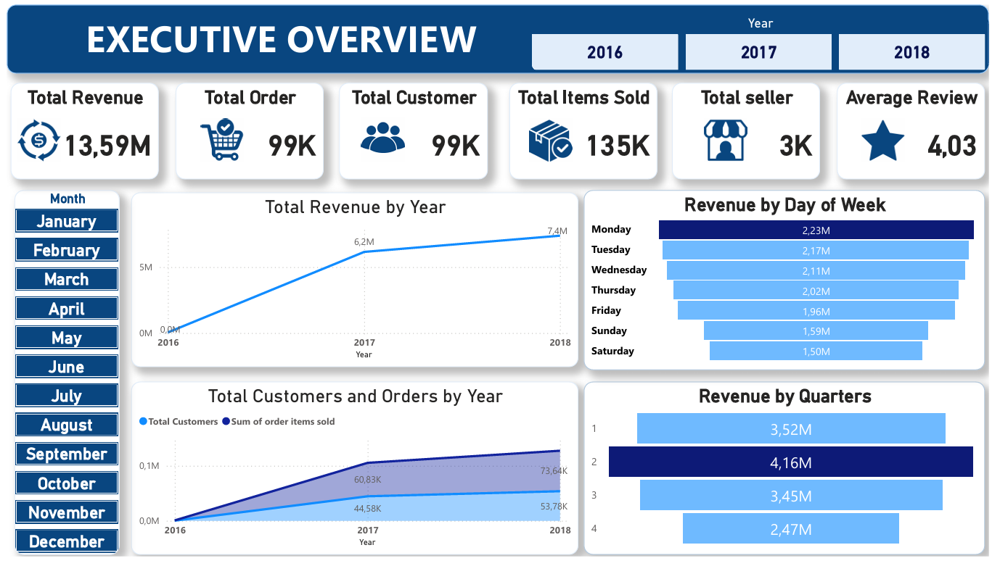
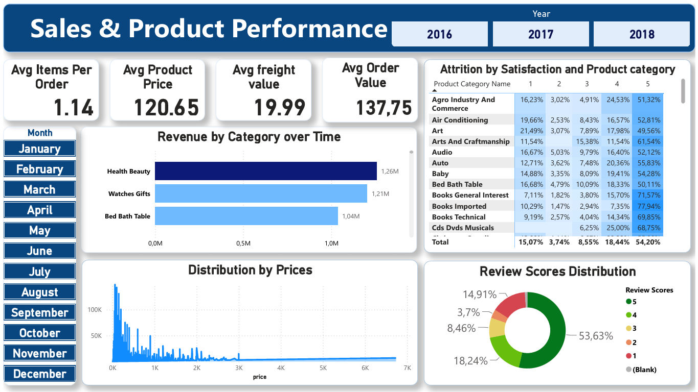

# E-commerce Analytics Platform

### Overview

An end-to-end data analytics platform built on a Brazilian E-Commerce Public Dataset by Olist. This project demonstrates the complete analytics workflow, from raw data ingestion and validation to SQL analytics and interactive Power BI dashboards.

---

### Project Architecture

---

### Tech Stack

# Programming
- Python
- SQL
# Database
- PostgreSQL
# Business Intelligence
- Microsoft Power BI
- DAX
- Data Modeling

---

### Workflow

---

### Data Warehouse Design

## Raw data schema

## Star schema

---
### Power BI Dashboard

---

### Key Business insights
- Achieved **13.59M BRL** in revenue across **99K orders**, serving **99K customers** through nearly **3K sellers**.
- Sales peaked in **Quarter 4**, with weekday purchases—especially on **Mondays**—contributing the highest revenue.
- **Health Beauty**, **Watches Gifts**, and **Bed Bath Table** were the leading product categories by revenue.
- Customers reported high satisfaction, with an **average rating of 4.03/5** and over **53%** of reviews receiving 5 stars.
- An **Average Order Value of 137.75 BRL** and **1.14 items per order** highlight opportunities to improve basket size through cross-selling and promotional bundles.

---
### Dataset
# Brazilian E-commerce Public Dataset by Olist

---

### Future Improvements
- Incremental ETL pipeline
- Workflow orchestration using Apache Airflow
- Data quality monitoring
- Automated testing
- Docker deployment
- Cloud deployment (AWS/Azure)
- CI/CD pipeline
